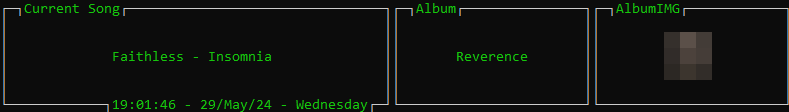
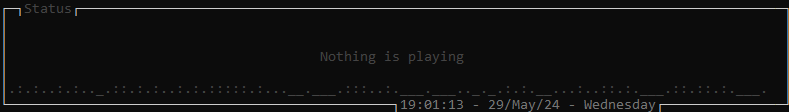
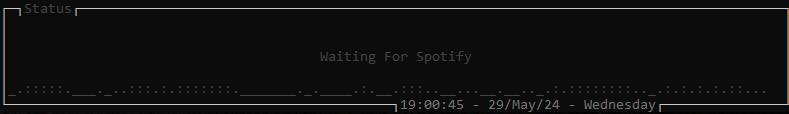

# NowPlayingTUI

A simple terminal like interface for showing Spotify now playing song data.

## Usage

Either clone the repository and build the project ~~or download the latest release from the releases page.~~ soon™

Run the program with `./NowPlayingTUI` or `NowPlayingTUI.exe` on Windows.

There are some command line arguments you can use:
-	`-x, -xcoord` Set the x position of the window
-	`-y, -ycoord` Set the y position of the window
	
Example: `./NowPlayingTUI -x "-790" -y "0"`

## Usage
The program will ask you for a Last.fm API key on first launch which will be saved to .env file, which you can find [here](https://www.last.fm/api/accounts).

## Preview

### Playing

### Idle

### Waiting

